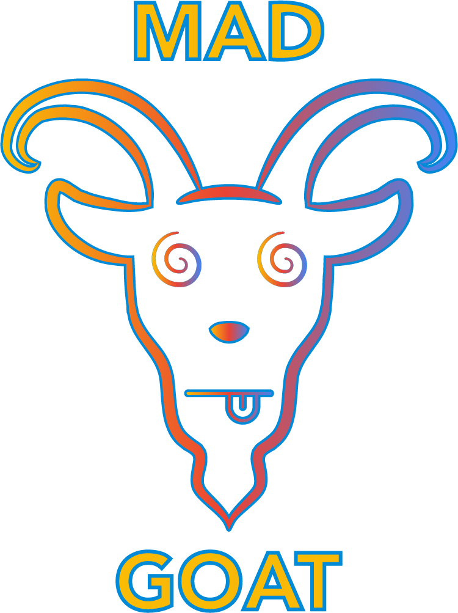

<a name="readme-top"></a>

[![Test][gha-test-badge]][gha-test-url] [![Publish Docker image][gha-build-badge]][gha-build-url]

<!-- PROJECT LOGO -->
<br />
<div align="center">
  <a href="https://github.com/MAD-Goat-Project/mad-web-app">
    
  </a>

  <p align="center">
    Deliberately insecure web application. Truly MAD.
    <br />
    <a href="https://github.com/MAD-Goat-Project/mad-web-app"><strong>Explore the docs »</strong></a>
    <br />
    <br />
    <a href="https://github.com/MAD-Goat-Project/mad-web-app">View Demo</a>
    ·
    <a href="https://github.com/MAD-Goat-Project/mad-web-app">Report Bug</a>
    ·
    <a href="https://github.com/MAD-Goat-Project/mad-web-app">Request Feature</a>
  </p>
</div>

<!-- TABLE OF CONTENTS -->
<details>
  <summary>Table of Contents</summary>
  <ol>
    <li>
      <a href="#about-the-project">About The Project</a>
      <ul>
        <li><a href="#built-with">Built With</a></li>
      </ul>
    </li>
    <li>
      <a href="#getting-started">Getting Started</a>
      <ul>
        <li><a href="#prerequisites">Prerequisites</a></li>
        <li><a href="#installation">Installation</a></li>
      </ul>
    </li>
    <li><a href="#license">License</a></li>
  </ol>
</details>

<!-- ABOUT THE PROJECT -->

## About The Project

Web Application for the MAD Goat Project.

<p align="right">(<a href="#readme-top">back to top</a>)</p>

### Built With

[![React][react.js]][react-url]

![Vite]

![TypeScript]

<p align="right">(<a href="#readme-top">back to top</a>)</p>

<!-- GETTING STARTED -->

## Getting Started

### Prerequisites

- yarn
  ```sh
  npm install --global yarn
  ```

### Installation

1. Clone the repo

2. Install NPM packages
   ```sh
   yarn install
   ```
3. Duplicate the .env.sample file and rename it to .env.local
   ```sh
   cp .env.sample .env.local
   ```
4. Start the development server
   ```sh
    yarn dev
   ```

<p align="right">(<a href="#readme-top">back to top</a>)</p>

<!-- LICENSE -->

## License

Distributed under the MIT License. See `LICENSE.txt` for more information.

## Icon Credits

<a href="https://iconscout.com/icons/security-ways" target="_blank">Free Security ways Icon</a> by <a href="https://iconscout.com/contributors/hana-arif">Vectors Point</a> on <a href="https://iconscout.com">IconScout</a>

<a href="https://iconscout.com/icons/unknown-folder" target="_blank">Free Unknown Folder Icon</a> by <a href="https://iconscout.com/contributors/theiconz">The Icon Z</a> on <a href="https://iconscout.com">IconScout</a>

<a href="https://iconscout.com/icons/agreement" target="_blank">Free Agreement Icon</a> by <a href="https://iconscout.com/contributors/iconlib">IconLib</a> on <a href="https://iconscout.com">IconScout</a>

<a href="https://iconscout.com/icons/scan" target="_blank">Free Scan Icon</a> by <a href="https://iconscout.com/contributors/adms-icon" target="_blank">ADMS Icons</a>

<a href="https://iconscout.com/icons/container" target="_blank">Free Container Icon</a> by <a href="https://iconscout.com/contributors/andinur">Andinur Studio</a> on <a href="https://iconscout.com">IconScout</a>

<a href="https://iconscout.com/icons/crane-lifter" target="_blank">Free Crane Lifter Icon</a> by <a href="https://iconscout.com/contributors/promotion-king" target="_blank">Rank Sol</a>

<a href="https://iconscout.com/icons/broken-protection" target="_blank">Free Broken Protection Icon</a> by <a href="https://iconscout.com/contributors/kerismaker">Kerismaker Studio</a> on <a href="https://iconscout.com">IconScout</a>

<a href="https://iconscout.com/icons/mind-system" target="_blank">Free Mind system Icon</a> by <a href="https://iconscout.com/contributors/turan-kent">Turan Kent</a> on <a href="https://iconscout.com">IconScout</a>

<a href="https://iconscout.com/lotties/security-research" target="_blank">Free Security Research  Animated Illustration</a> by <a href="https://iconscout.com/contributors/nanoagency" target="_blank">nanoagency</a>

<a href="https://iconscout.com/lottie-animations/content-moderation" class="text-underline font-size-sm" target="_blank">Content Moderation</a> by <a href="https://iconscout.com/contributors/nanoagency" class="text-underline font-size-sm" target="_blank">nanoagency</a>

<a href="https://iconscout.com/lottie-animations/singing-contract" class="text-underline font-size-sm" target="_blank">Singing Contract</a> by <a href="https://iconscout.com/contributors/nanoagency" class="text-underline font-size-sm" target="_blank">nanoagency</a>

<a href="https://iconscout.com/lottie-animations/coronavirus" class="text-underline font-size-sm" target="_blank">Coronavirus</a> by <a href="https://iconscout.com/contributors/hill-motion" class="text-underline font-size-sm">Hill Motion</a> on <a href="https://iconscout.com" class="text-underline font-size-sm">IconScout</a>

<p align="right">(<a href="#readme-top">back to top</a>)</p>

<!-- MARKDOWN LINKS & IMAGES -->
<!-- https://www.markdownguide.org/basic-syntax/#reference-style-links -->

[contributors-shield]: https://img.shields.io/github/contributors/MAD-Goat-Project/mad-web-app.svg?style=for-the-badge
[contributors-url]: https://github.com/MAD-Goat-Project/mad-web-app/graphs/contributors
[forks-shield]: https://img.shields.io/github/forks/MAD-Goat-Project/mad-web-app.svg?style=for-the-badge
[forks-url]: https://github.com/MAD-Goat-Project/mad-web-app/network/members
[stars-shield]: https://img.shields.io/github/stars/MAD-Goat-Project/mad-web-app.svg?style=for-the-badge
[stars-url]: https://github.com/MAD-Goat-Project/mad-web-app/stargazers
[issues-shield]: https://img.shields.io/github/issues/MAD-Goat-Project/mad-web-app.svg?style=for-the-badge
[issues-url]: https://github.com/MAD-Goat-Project/mad-web-app/issues
[license-shield]: https://img.shields.io/github/license/MAD-Goat-Project/mad-web-app.svg?style=for-the-badge
[license-url]: https://github.com/MAD-Goat-Project/mad-web-app/blob/main/LICENSE
[product-screenshot]: images/screenshot.png
[next.js]: https://img.shields.io/badge/next.js-000000?style=for-the-badge&logo=nextdotjs&logoColor=white
[next-url]: https://nextjs.org/
[react.js]: https://img.shields.io/badge/React-20232A?style=for-the-badge&logo=react&logoColor=61DAFB
[react-url]: https://reactjs.org/
[vue.js]: https://img.shields.io/badge/Vue.js-35495E?style=for-the-badge&logo=vuedotjs&logoColor=4FC08D
[vue-url]: https://vuejs.org/
[angular.io]: https://img.shields.io/badge/Angular-DD0031?style=for-the-badge&logo=angular&logoColor=white
[angular-url]: https://angular.io/
[svelte.dev]: https://img.shields.io/badge/Svelte-4A4A55?style=for-the-badge&logo=svelte&logoColor=FF3E00
[svelte-url]: https://svelte.dev/
[laravel.com]: https://img.shields.io/badge/Laravel-FF2D20?style=for-the-badge&logo=laravel&logoColor=white
[laravel-url]: https://laravel.com
[bootstrap.com]: https://img.shields.io/badge/Bootstrap-563D7C?style=for-the-badge&logo=bootstrap&logoColor=white
[bootstrap-url]: https://getbootstrap.com
[jquery.com]: https://img.shields.io/badge/jQuery-0769AD?style=for-the-badge&logo=jquery&logoColor=white
[jquery-url]: https://jquery.com
[gha-test-badge]: https://github.com/MAD-Goat-Project/mad-web-app/actions/workflows/test.yml/badge.svg
[gha-test-url]: https://github.com/MAD-Goat-Project/mad-web-app/actions/workflows/test.yml
[gha-build-badge]: https://github.com/MAD-Goat-Project/mad-web-app/actions/workflows/publish.yml/badge.svg
[gha-build-url]: https://github.com/MAD-Goat-Project/mad-web-app/actions/workflows/publish.yml
[contributors-shield]: https://img.shields.io/github/contributors/MAD-Goat-Project/mad-web-app.svg?style=for-the-badge
[contributors-url]: https://github.com/MAD-Goat-Project/mad-web-app/graphs/contributors
[forks-shield]: https://img.shields.io/github/forks/MAD-Goat-Project/mad-web-app.svg?style=for-the-badge
[forks-url]: https://github.com/MAD-Goat-Project/mad-web-app/network/members
[stars-shield]: https://img.shields.io/github/stars/MAD-Goat-Project/mad-web-app.svg?style=for-the-badge
[license-shield]: https://img.shields.io/github/license/MAD-Goat-Project/mad-web-app.svg?style=for-the-badge
[issues-shield]: https://img.shields.io/github/issues/MAD-Goat-Project/mad-web-app.svg?style=for-the-badge
[issues-url]: https://github.com/MAD-Goat-Project/mad-web-app/issues
[stars-url]: https://github.com/MAD-Goat-Project/mad-web-app/stargazers
[license-url]: https://github.com/MAD-Goat-Project/mad-web-app/blob/main/LICENSE
[react.js]: https://img.shields.io/badge/React-20232A?style=for-the-badge&logo=react&logoColor=61DAFB
[react-url]: https://reactjs.org/
[min.io]: https://img.shields.io/avatars.githubusercontent.com/u/695951?s=200&v=4
[minio-url]: https://min.io/
[NodeJS]: https://img.shields.io/badge/Node.js-43853D?style=for-the-badge&logo=node.js&logoColor=white
[Typescript]: https://img.shields.io/badge/TypeScript-007ACC?style=for-the-badge&logo=typescript&logoColor=white
[postgres]: https://img.shields.io/badge/PostgreSQL-316192?style=for-the-badge&logo=postgresql&logoColor=white
[Java]: https://img.shields.io/badge/Java-ED8B00?style=for-the-badge&logo=openjdk&logoColor=white
[Spring]: https://img.shields.io/badge/Spring-6DB33F?style=for-the-badge&logo=spring&logoColor=white
[MongoDB]: https://img.shields.io/badge/MongoDB-4EA94B?style=for-the-badge&logo=mongodb&logoColor=white
[NestJS]: https://img.shields.io/badge/nestjs-%23E0234E.svg?style=for-the-badge&logo=nestjs&logoColor=white
[rabbitmq]: https://img.shields.io/badge/rabbitmq-%23FF6600.svg?&style=for-the-badge&logo=rabbitmq&logoColor=white
[Kubernetes]: https://img.shields.io/badge/kubernetes-%23326ce5.svg?style=for-the-badge&logo=kubernetes&logoColor=white
[Traefik Proxy]: https://img.shields.io/static/v1?style=for-the-badge&message=Traefik+Proxy&color=24A1C1&logo=Traefik+Proxy&logoColor=FFFFFF&label=
[Docker]: https://img.shields.io/static/v1?style=for-the-badge&message=Docker&color=2496ED&logo=Docker&logoColor=FFFFFF&label=
[Vite]: https://img.shields.io/badge/vite-%23646CFF.svg?style=for-the-badge&logo=vite&logoColor=white
[Typescript]: https://img.shields.io/badge/TypeScript-007ACC?style=for-the-badge&logo=typescript&logoColor=white
